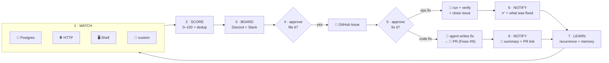
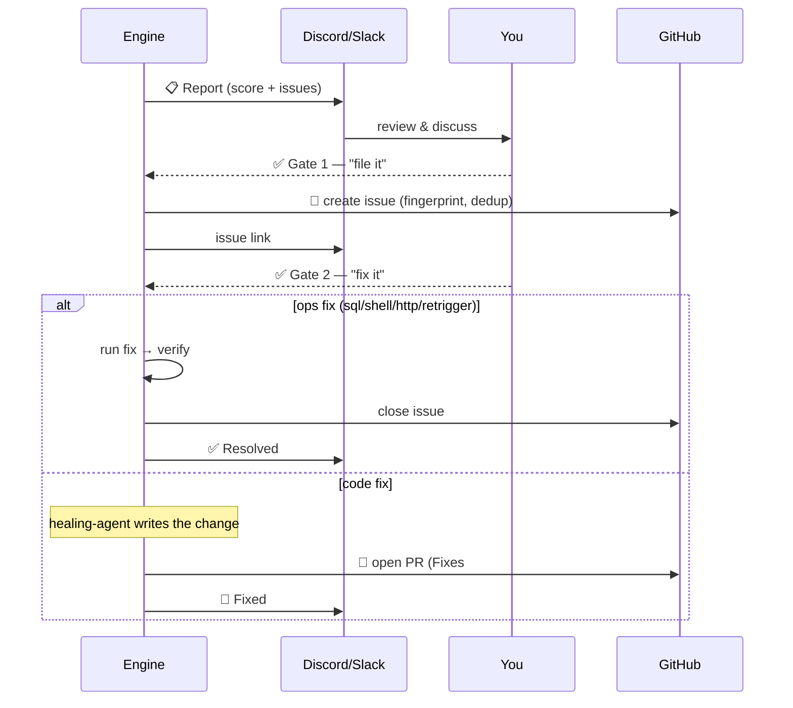
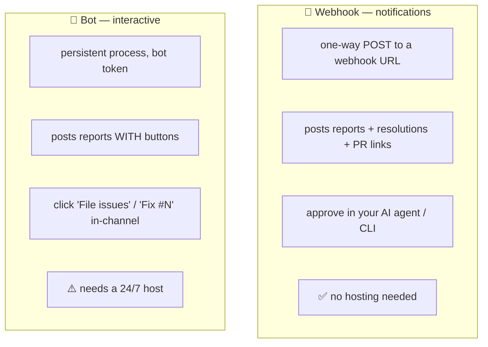
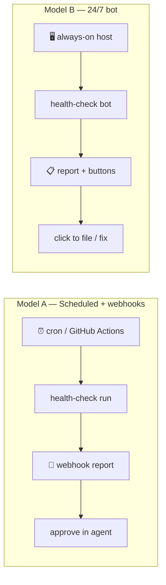

<div align="center">

# 🩺 Health Check Plugin

**A universal, configurable health-check + self-healing board for any system.**

Monitor anything · score it 0–100 · dedup issues · discuss in Discord/Slack ·
file GitHub issues on approval · auto-fix or open a PR · report back — automatically.

`CLI` · `Claude Code` · `Codex` · `Gemini CLI` — one engine, every agent.

</div>

---

## What it does, in one picture



You bring **what** to monitor (one JSON config). The engine handles everything
else — scoring, deduplication, the chat board, GitHub issues, healing, PRs, and
memory. Nothing about your system is hardcoded, so the same tool watches a data
pipeline, a SaaS API, an ML job, CI/CD, or plain infrastructure.

---

## Why it's different

|  | What you get |
|--|--------------|
| 🎯 **Universal** | ~65% generic core + ~35% defined purely in config. No code changes to adapt it. |
| 🔌 **3 collector types built in** | `postgres`, `http`, `shell` — plus a clean interface for custom ones. |
| 🧮 **Scored & deduped** | 0–100 health score; a fingerprint stops the same issue being raised twice. |
| 💬 **Multi-channel board** | Broadcast to **Discord *and* Slack** at once (plus console). |
| ✅ **Two approval gates** | Nothing is filed or fixed without you saying so. |
| 🔧 **Real healing** | Ops fixes run + verify + close; code fixes become a **PR** with a summary. |
| 🧠 **Memory** | Tracks recurrence across runs and compounds what fixes worked. |
| 🤖 **Any agent** | Plain CLI + skills for Claude Code, Codex, and Gemini CLI. |
| ⏰ **Autonomous** | Set it up once; it runs on a schedule or as a 24/7 bot. |

---

## 60-second start

```bash
git clone https://github.com/ankit4479/health-check-plugin
cd health-check-plugin && npm install

npx health-check init          # writes health-check.config.json (with examples)
npx health-check run           # console report — no external services needed
```

The starter config has working `postgres`, `http`, and `shell` collectors. Point
them at your own system and you're monitoring. Chat, GitHub, healing, and the bot
are all opt-in.

> **Set it up the easy way:** in your AI agent run **`/health-setup`** — a guided
> wizard that asks for everything (what to monitor, channels, GitHub, healing, and
> the schedule) and leaves it running autonomously.

---

## The two approval gates

The board is human-in-the-loop by design. Two explicit gates — nothing happens
between them without your go-ahead.



- **Gate 1 — file it.** A scored report lands in every channel. On approval, a
  GitHub issue is created (deduped by fingerprint: open→comment, closed→reopen).
- **Gate 2 — fix it.** Once an issue exists, the healer asks again. Then either an
  **ops fix** runs deterministically and closes the issue, or the agent writes a
  **code fix** and ships a **PR** (`Fixes #N`) — *no PR is ever created without a
  real fix*. Either way, the channels get a notification with the GitHub/PR link.

---

## Configure it for your system

Everything lives in `health-check.config.json`. A **collector** is the unit of
monitoring:

```jsonc
{
  "id": "stuck_jobs",
  "type": "postgres",
  "dataSource": "app_db",
  "query": "SELECT id FROM jobs WHERE status='processing' AND created_at < now() - ($1 || ' hours')::interval",
  "issueWhen": { "rowsAtLeast": 1 },
  "severity": "high",
  "title": "{{count}} jobs stuck in processing",
  "fingerprintFields": ["id"],
  "suggestedFix": "Re-run the processor or reset stuck rows.",
  "fix": {                          // optional → makes it auto-healable
    "type": "sql",
    "dataSource": "app_db",
    "command": "UPDATE jobs SET status='pending' WHERE status='processing' AND created_at < now() - interval '1 hour'",
    "estimatedRisk": "medium",
    "safetyGates": ["Bounded row count", "Re-processing is idempotent"]
  }
}
```

| Type | Fetches | Fires when | Good for |
|------|---------|-----------|----------|
| `postgres` | rows from read-only SQL (`$1` = lookback hrs) | `rowsAtLeast` | stuck rows, error counts, data freshness |
| `http` | a URL probe | status ≠ `expectStatus`, or timeout | uptime, webhooks, downstream deps |
| `shell` | a command's stdout | `numericAtLeast`/`AtMost`, or non-empty | disk %, queue depth, `kubectl` counts |

→ Full reference: [`docs/configuration.md`](docs/configuration.md) ·
Cookbook: [`docs/collector-reference.md`](docs/collector-reference.md)

---

## Notifications vs. the bot

Two ways the channel works — pick one or both. This is the key operational choice:



| | Webhook (notify) | Bot (interactive) |
|--|------------------|-------------------|
| Sends reports / PR links | ✅ | ✅ |
| Reacts to clicks (buttons) | ❌ | ✅ |
| Approve where | AI agent / `--approve` | in Discord / Slack |
| Hosting | none | always-on process |
| Setup | a webhook URL | bot token + 24/7 host |

Both support **Discord *and* Slack** simultaneously.

---

## Set up once, run autonomously

```bash
health-check schedule --at "09:00" --tz "Asia/Kolkata" --mode both
```

Generates a **cron line** (for a machine) and a **GitHub Actions workflow** (cloud —
cron auto-converted to UTC). After that it runs on its own.



→ Deployment (Docker / systemd / Railway / Render / Fly): [`docs/deployment.md`](docs/deployment.md)

---

## CLI reference

```
health-check run         Collect → score → persist → deliver a report
                         --file-issues · --plan · --period <h>
health-check report      Re-render the latest report
health-check issues      File the latest report's issues to GitHub (dedup)
health-check plan        Print an advisory healing plan
health-check heal        Execute approved fixes from the latest report
health-check heal-issue  The healer loop — remediate FROM open GitHub issues
                         --list · --approve all|<#,#> · --issue <#,#>
health-check verify      Recurring vs. resolved issues across runs
health-check schedule    Set up autonomous runs (cron + GitHub Actions)
                         --at "09:00" --tz "<IANA>" --mode cron|github-actions|both
health-check bot         Start the 24/7 interactive bot (Discord/Slack buttons)
health-check init        Scaffold health-check.config.json
```

`run` exits **2** when any critical issue exists — wire it into CI to gate deploys.

---

## Install as a plugin

**Claude Code** (skills `/health-setup`, `/health-run`, `/health-issues`,
`/health-heal-issue`, …):
```bash
claude plugin marketplace add https://github.com/<your-marketplace-repo>
claude plugin install health-check-plugin@<marketplace-name>
```

**Codex / Gemini CLI** — drop the repo in (or submodule); `AGENTS.md` / `GEMINI.md`
tell the agent how to drive the same CLI. No code changes — the engine is
agent-agnostic.

---

## Configuration & secrets

Secrets never live in the config — it references **env var names**; values come from
your environment. See [`.env.example`](.env.example).

| What | Config key | Env (example) |
|------|-----------|---------------|
| Postgres source | `dataSources.*.urlEnv` | `DATABASE_URL` |
| Discord (notify) | `channels[].webhookEnv` | `HEALTH_DISCORD_WEBHOOK_URL` |
| Slack (notify) | `channels[].webhookEnv` | `HEALTH_SLACK_WEBHOOK_URL` |
| Discord (bot) | `bot.discord.botTokenEnv` | `HEALTH_DISCORD_BOT_TOKEN` |
| Slack (bot) | `bot.slack.botTokenEnv` / `appTokenEnv` | `HEALTH_SLACK_BOT_TOKEN` / `HEALTH_SLACK_APP_TOKEN` |
| GitHub repo / token | `github.repoEnv` / `tokenEnv` | `HEALTH_GITHUB_REPO` / `GITHUB_TOKEN` |

---

## Why it's universal

```
┌──────────────────────── Generic core (~65%) — copy verbatim ─────────────────────────┐
│ scoring · fingerprint dedup · board flow · GitHub integration · healing framework     │
│ recurrence memory · multi-channel delivery · the bot · the CLI                        │
└───────────────────────────────────────────────────────────────────────────────────────┘
┌──────────────────── Your domain (~35%) — pure config, no code ───────────────────────┐
│ which collectors · what they query · severity rules · fix actions · channels · schedule│
└───────────────────────────────────────────────────────────────────────────────────────┘
```

Any system with a measurable signal fits: **data pipelines** (run rates, stuck
entities, queue depth) · **web/SaaS** (uptime, error rates, latency) · **ML** (drift,
inference latency, data quality) · **CI/CD & infra** (disk, deploys, vulnerabilities).
Full design: [`docs/universal-framework.md`](docs/universal-framework.md).

---

## Repository layout

```
health-check-plugin/
├── src/
│   ├── cli.ts                 # command entry point
│   ├── config.ts              # config schema, loader, validation
│   ├── collectors/            # postgres · http · shell + runner
│   ├── scoring.ts             # 0–100 scoring + bands
│   ├── fingerprint.ts         # cross-run dedup
│   ├── report.ts              # report assembly
│   ├── delivery/              # console · discord · slack (multi-channel board)
│   ├── github.ts              # issues: create/dedup/reopen/close + fetch + open PR
│   ├── healing/               # plan · execute · issue-heal (the healer loop)
│   ├── bot/                   # 24/7 interactive bot (Discord + Slack) + scheduler
│   ├── schedule.ts            # cron + GitHub Actions generators
│   ├── memory.ts + state.ts   # recurrence history + solutions log
│   └── orchestrator.ts        # the full run cycle
├── config/health-check.config.example.json
├── skills/                    # Claude Code: setup · run · report · issues · heal-issue · …
├── agents/                    # health-check-agent · healing-agent
├── commands/                  # cross-agent SOP workflows
├── docs/                      # configuration · collectors · framework · operator · deployment
├── .claude-plugin/plugin.json # Claude Code manifest
├── hooks/ + scripts/          # SessionStart config detection
├── AGENTS.md  GEMINI.md       # Codex / Gemini CLI entrypoints
├── Dockerfile                 # 24/7 bot image
└── README.md
```

---

## Docs

| Doc | What's in it |
|-----|--------------|
| [`docs/configuration.md`](docs/configuration.md) | Every config field, with examples |
| [`docs/collector-reference.md`](docs/collector-reference.md) | The 3 collector types + custom |
| [`docs/universal-framework.md`](docs/universal-framework.md) | The design philosophy |
| [`docs/operator-guide.md`](docs/operator-guide.md) | Day-to-day operation + scheduling |
| [`docs/deployment.md`](docs/deployment.md) | Autonomy models + hosting the bot |

---

<div align="center">

**MIT** © [ankit4479](https://github.com/ankit4479) · built to be forked and made yours

</div>
