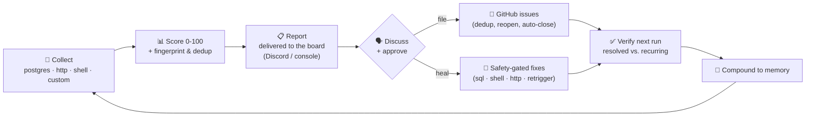

# Health Check Plugin

**A universal, configurable health-check + healer board for any automation or software system.**

Point it at your system, and it collects health signals, scores overall health
**0–100**, fingerprints and **dedups** issues across runs, posts a report to a chat
channel for your team to **discuss**, and — once you approve — opens **GitHub issues**
and runs **safety-gated auto-heals**. It learns: an issue that persists across runs is
flagged as recurring, and an issue that disappears is verified as resolved.

It runs three ways from the same code:
- a **standalone CLI** (`npx health-check run`) for humans, cron, CI, or any scheduler,
- a **Claude Code plugin** (skills, agents, hooks),
- and via **Codex / Gemini CLI** (through `AGENTS.md` / `GEMINI.md`).

Nothing about your system is hardcoded. *What* to monitor, *how* to score it, *where*
to report, and *whether/how* to heal all live in one JSON config — so the same engine
watches a data pipeline, a SaaS API, an ML system, a CI/CD setup, or plain infra.

---

## The idea — a healer board



The "board" is the human-in-the-loop step: a scored report lands in your channel, the
team talks it through, and only then does the system act. Auto-healing is optional and
locked behind explicit approval and per-fix safety gates.

---

## Quickstart (standalone, 60 seconds)

```bash
git clone https://github.com/ankit4479/health-check-plugin
cd health-check-plugin && npm install

# scaffold a config in YOUR project, then edit it
npx health-check init            # writes health-check.config.json
$EDITOR health-check.config.json

# take a reading (console output, no external services needed)
npx health-check run
```

The default config has working examples of all three collector types. Edit it to point
at your own database / endpoints / commands. No chat or GitHub setup is required to
start — those are opt-in.

---

## Install as a plugin

### Claude Code

```bash
claude plugin marketplace add https://github.com/<your-marketplace-repo>
claude plugin install health-check-plugin@<marketplace-name>
```

Then use the slash commands: `/health-run`, `/health-report`, `/health-issues`,
`/health-heal`, `/health-configure`, `/health-remember`. A SessionStart hook detects
your config and surfaces recurring issues automatically.

### Codex / Gemini CLI

Drop the repo into your project (or add it as a submodule). `AGENTS.md` (Codex) and
`GEMINI.md` (Gemini CLI) tell the agent how to drive the same CLI. No code changes —
the engine is agent-agnostic.

---

## How it works

| Stage | What happens | Where it's defined |
|-------|--------------|--------------------|
| **Collect** | Each enabled collector fetches a signal (SQL rows, an HTTP status, a shell number). | `collectors[]` in config |
| **Shape** | A declarative `issueWhen` predicate decides if it's an issue; the title template fills in `{{count}}`/`{{value}}`/`{{field:NAME}}`. | per collector |
| **Score** | `score = 100 − Σ(weight × count)`; bands: healthy ≥90, warning ≥70, degraded ≥50, else critical. | `severityWeights`, `scoreBands` |
| **Dedup** | A 16-char fingerprint identifies "the same issue" across runs and against GitHub. | `fingerprintFields` |
| **Deliver** | The report goes to the console always, and Discord if configured. | `channel` |
| **File** | On approval, issues become GitHub issues — open→comment, closed→reopen, none→create. | `github` |
| **Heal** | On approval, declarative fixes run inside a safety envelope. | `healing` + collector `fix` |
| **Remember** | Fingerprint history tracks recurrence; the solutions log compounds fix outcomes. | `.health-check/` |

---

## Configure it for your system

Everything lives in `health-check.config.json`. A collector is the unit of monitoring:

```jsonc
{
  "id": "stuck_jobs",
  "type": "postgres",
  "dataSource": "app_db",
  "query": "SELECT id FROM jobs WHERE status='processing' AND created_at < now() - ($1 || ' hours')::interval",
  "issueWhen": { "rowsAtLeast": 1 },
  "severity": "high",
  "title": "{{count}} jobs stuck in processing",
  "fingerprintFields": ["id"],
  "suggestedFix": "Re-run the processor or reset stuck rows.",
  "fix": {                         // optional — makes it auto-healable
    "type": "sql",
    "dataSource": "app_db",
    "command": "UPDATE jobs SET status='pending' WHERE status='processing' AND created_at < now() - interval '1 hour'",
    "estimatedRisk": "medium",
    "safetyGates": ["Bounded row count", "Re-processing is idempotent"]
  }
}
```

Three built-in collector types cover most needs:

| Type | Fetches | Fires when | Example |
|------|---------|-----------|---------|
| `postgres` | rows from read-only SQL (`$1` = lookback hours) | `rowsAtLeast` | stuck rows, error counts, data freshness |
| `http` | a URL probe | status ≠ `expectStatus`, or timeout | uptime, webhook receiver, downstream deps |
| `shell` | stdout of a command | `numericAtLeast`/`numericAtMost`, or non-empty | disk %, queue depth, `kubectl` counts |

Full field reference: [`docs/configuration.md`](docs/configuration.md).
Collector cookbook: [`docs/collector-reference.md`](docs/collector-reference.md).

---

## CLI reference

```
health-check run        Collect, score, persist, and deliver a report
                        --file-issues  also open GitHub issues
                        --plan         also print a healing plan
                        --period <h>   override the lookback window
health-check report     Re-render the latest saved report
health-check issues     File the latest report's issues to GitHub (dedup by fingerprint)
health-check plan       Print an advisory healing plan
health-check heal       Execute approved fixes  (--approve all | --approve 0,2,3)
health-check verify     Show recurring vs. resolved issues across runs
health-check init       Scaffold health-check.config.json
```

`run` exits with code **2** when any critical issue is present — wire it into CI to
gate deploys.

---

## Configuration & environment

Secrets never live in the config — the config references **env var names**, and the
values come from your environment (`.env`, CI secrets, etc.). See [`.env.example`](.env.example).

| What | Config key | Env (example) |
|------|-----------|---------------|
| Postgres data source | `dataSources.*.urlEnv` | `DATABASE_URL` |
| Discord board | `channel.webhookEnv` | `HEALTH_DISCORD_WEBHOOK_URL` |
| GitHub repo | `github.repoEnv` | `HEALTH_GITHUB_REPO` (`owner/repo`) |
| GitHub token | `github.tokenEnv` | `GITHUB_TOKEN` (or falls back to the `gh` CLI) |

---

## Scheduling

It's a CLI, so any scheduler works. A daily cron:

```cron
0 9 * * *  cd /path/to/project && npx health-check run --file-issues >> health.log 2>&1
```

It also drops straight into GitHub Actions, Trigger.dev, or any job runner — see
[`docs/operator-guide.md`](docs/operator-guide.md).

---

## Why it's universal

About **65%** of the system is generic and identical for every project — scoring,
fingerprint dedup, the board/conversation flow, GitHub integration, the healing
framework, recurrence memory, and delivery. The other **35%** — which collectors exist,
what they query, severity rules, and fix actions — is pure configuration. You bring the
*what*; the engine handles the *how*. The full design is in
[`docs/universal-framework.md`](docs/universal-framework.md).

---

## Repository layout

```
health-check-plugin/
├── src/                       # the engine (runnable CLI + library)
│   ├── cli.ts                 # command entry point
│   ├── config.ts              # config schema, loader, validation
│   ├── collectors/            # postgres · http · shell + runner
│   ├── scoring.ts             # 0-100 scoring + bands
│   ├── fingerprint.ts         # cross-run dedup
│   ├── report.ts              # report assembly
│   ├── delivery/              # console + discord (the board)
│   ├── github.ts              # issue create/dedup/reopen/close
│   ├── healing/               # plan (advisory) + execute (safety-gated)
│   ├── memory.ts + state.ts   # recurrence history + solutions log
│   └── orchestrator.ts        # the full run cycle
├── config/health-check.config.example.json
├── skills/                    # Claude Code slash commands
├── agents/                    # health-check-agent · healing-agent
├── commands/                  # cross-agent SOP workflows
├── docs/                      # configuration · collectors · framework · operator guide
├── .claude-plugin/plugin.json # Claude Code manifest
├── hooks/ + scripts/          # SessionStart config detection
├── AGENTS.md  GEMINI.md       # Codex / Gemini CLI entrypoints
└── README.md
```

---

## License

MIT — see [LICENSE](LICENSE). Built by [ankit4479](https://github.com/ankit4479).
